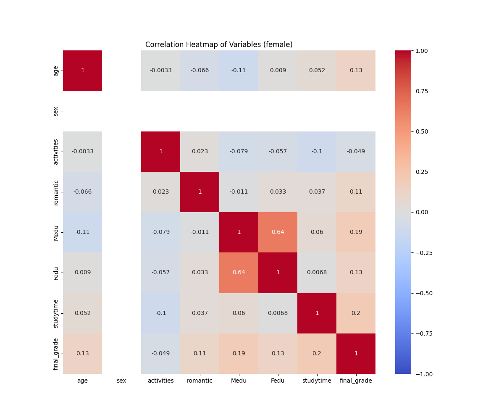
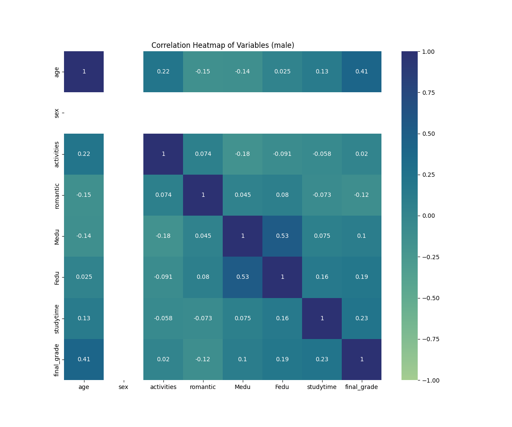

# Student Academic Performance Analysis 
- Link to archival record: [CodeOcean](https://codeocean.com/capsule/0621519/tree)
- Contributors: Bulleted list of contributors (with optional ORCIDs)
    - Jian Jo: [ORCID link](https://orcid.org/0009-0007-2534-7499)
    - Jocelyn Yang: [ORCID link](https://orcid.org/0009-0003-1848-0794)

This student academic performance analysis project investigates gender-specific predictors of academic success by analyzing educational datasets from both high school and college students. The research aims to understand how various factors such as study time, parental educations, and extracurricular activities differently affect academic outcomes based on gender. This research seeks to discover relationships among the features from datasets to better understand the complex dynamics of academic achievement.

The study addresses two primary questions:
1. Are there gender-specific predictors of academic success?
2. How do factors like study time, parental influence, and extracurricular involvement differ between genders in relation to academic outcomes?

This research contributes to our understanding of how gender intersects with various factors to influence academic outcomes. The findings can help educators and administrators develop more effective, gender-sensitive approaches to student support and intervention strategies. By recognizing these gender-specific patterns, educational institutions can better tailor their resources and support systems to address the unique challenges faced by different student groups. The project demonstrates the importance of considering gender as a significant variable in educational outcomes, while also highlighting the complex interplay of various social and academic factors that contribute to student success. These insights can inform more nuanced and effective educational policies and support systems.

## Environment Set up
We created a virtual python environment that includes all the necessary libraries for this project. The details are in [environment.md](../setup/environment.md). 

## Data Importation 
We picked our datasets both from the UCI Machine Learning Repository website.
- [highschool student dataset](https://archive.ics.uci.edu/dataset/320/student+performance): Cortez, Paulo. "Student Performance." UCI Machine Learning Repository, 2008, https://doi.org/10.24432/C5TG7T.
- [college student dataset](https://archive.ics.uci.edu/dataset/856/higher+education+students+performance+evaluation): Yilmaz, Nevriye and Boran Şekeroğlu. "Higher Education Students Performance Evaluation." UCI Machine Learning Repository, 2019, https://doi.org/10.24432/C51G82.

**1. Student Performance** 
<br>
The Student Performance dataset is a comprehensive collection of student data from two Portuguese secondary schools, focusing on student achievement in Mathematics and Portuguese language courses. This dataset contains 649 rows and 30 columns combined with math and portuguese datasets. The features from the dataset hold a wide range of student attributes, including:
- Demographic information: age, gender, and address type
- Family background: family size, parental education, occupation, and cohabitation status
- Academic factors: study time, previous failures, and extra educational support
- Social and lifestyle factors: internet access, romantic relationships, and alcohol consumption
- The target variable is the final grade (G3), which is strongly correlated with first and second period grades (G1 and G2). All features are encoded as integer or categorical values, with no missing data points.

**2. Higher Education Students Performance Evaluation**
<br>
The Higher Education Students Performance Evaluation dataset is a comprehensive collection of student data gathered from the Faculty of Engineering and Faculty of Educational Sciences in 2019. This dataset consists of 145 rows and 31 columns.
The features from the dataset encompasses a wide range of student attributes, including:
- Personal information: age, gender, high school type, and scholarship status
- Family background: parental education, occupation, and marital status
- Academic habits: study hours, class attendance, and exam preparation methods
- Extracurricular activities: sports, artistic pursuits, and conference attendance
- The target variable is the student's final grade, categorized from "Fail" to "AA"

All features are encoded as integer values, with no missing data points.

## Data Pre-Processing 
### High School Data 
>[highschool_data_import.py](../scripts/highschool_data_import.py) 

This python file includes the process of importing high school dataset and pre-processing/cleaning the dataset.

**Feature Selection and Renaming:**
- Selected features include: age, sex, activities, romantic status, parents' education, parental status, and study time.
- A new column "school" is added with the value "highschool" to identify the data source.

**Data Transformations:**
- Age is converted to categories (0: <18, 1: 18-21, 2: 22+).
- Sex is encoded numerically (1: female, 2: male).
- Romantic status is encoded (1: yes, 2: no).
- Activities are converted to integer values (1: yes, 2: no).

**Target Variable:**
- The final grade (G3) is converted to a letter grade scale (0-7) for the high school grading system to match the college grading scale, allowing for unified analysis.

### College Data 
>[college_data_import.py](../scripts/college_data_import.py)

This script includes the process of importing college dataset and pre-processing/cleaning the dataset.

**Feature Selection and Renaming:**
- Similar features to the high school dataset are selected and renamed for consistency.
- A "school" column is added with the value "college".

**Data Transformations:**
- Parents' education levels are standardized (1-4 scale) by replacing 5 & 6 (masters & Ph.D) with 4 (higher education).
- Parental status is converted to binary (T: together, A: apart).
- Study time categories are adjusted to match the high school dataset.

## Data Integration
>[data_integration.py](../scripts/data_integration.py)

This script combines the preprocessed high school and college datasets.

**Process:**
1. Loads the cleaned datasets from their respective CSV files.
2. Concatenates the two datasets into a single DataFrame.
3. Saves the integrated dataset as 'students.csv' in the 'integrated_data' directory.

## Data Acquisition
>[data_acquisition.py](../scripts/data_acquisition.py)

This script checks if the datasets exist in the correct location. 

## Data Analysis 
>[data_analysis.py](../scripts/data_analysis.py)

This script performs initial exploratory data analysis on the integrated dataset.

**Analysis Steps:**
1. Loads the integrated 'students.csv' file.
2. Prints the data types of all columns.
3. Split the dataset into each gender.
4. Creates a correlation heatmap per gender.

**Recommendations for Further Analysis**
1. Conduct comparative analyses between high school and college students.
2. Investigate the impact of socio-economic factors (parents' education, parental status) on academic performance.
3. Explore the relationship between extracurricular activities and academic outcomes.
4. Consider implementing machine learning models to predict student performance based on the available features.

## Data Visualization
### Correlation Heatmap for Female

The correlation heatmap for female students reveals several notable patterns:
- Strong Positive Correlations:
    - Mother's education (Medu) and father's education (Fedu) show the strongest positive correlation (0.64), indicating that female students' parents tend to have similar education levels
    - Study time and final grades have a moderate positive correlation (0.2), suggesting that more study time relates to better academic performance
    - Age and final grades show a weak positive correlation (0.13)
- Weak or No Correlations:
    - Activities participation shows very weak negative correlations with most variables
    - Romantic relationships have minimal impact on other variables, with correlation coefficients close to zero
    - Age has negligible correlations with most variables except final grades

### Correlation Heatmap for Male

The correlations for the heatmap of male students are demonstrated quite differently.
- Strong Positive Correlations:
    - Mother's and father's education levels show a moderately strong correlation (0.53)
    - Age and final grades demonstrate a stronger positive correlation (0.41) compared to females
    - Study time and final grades show a positive correlation (0.23)
- Notable Differences:
    - Activities show a positive correlation with age (0.22)
    - Romantic relationships have a slight negative correlation with final grades (-0.12), which suggests that male students who are in romantic relationships tend to have slightly lower academic performance
    - Mother's education has a negative correlation with activities (-0.18)

### Comparative Analysis between Female & Male

**Primary Variables Comparison**

| Variable Pair | Female Students | Male Students | Interpretation |
|--------------|-----------------|---------------|----------------|
| Age - Final Grade | 0.13 | 0.41 | Males show stronger correlation between age and grades |
| Study Time - Final Grade | 0.20 | 0.23 | Similar positive impact of study time on grades |
| Romantic - Final Grade | 0.11 | -0.12 | Opposite effects: positive for females, negative for males |
| Mother's Ed - Father's Ed | 0.64 | 0.53 | Stronger parental education correlation in female cases |

**Age Correlations**

| Variable | Female Students | Male Students | Interpretation |
|----------|----------------|---------------|----------------|
| Activities | -0.0033 | 0.22 | Males show stronger age-activity connection |
| Romantic | -0.066 | -0.15 | Stronger negative correlation for males |
| Mother's Education | -0.11 | -0.14 | Similar slight negative correlations |

**Academic Performance Factors**

| Variable | Female Students | Male Students | Interpretation |
|----------|----------------|---------------|----------------|
| Mother's Education | 0.19 | 0.10 | Stronger influence on female grades |
| Father's Education | 0.13 | 0.19 | Slightly stronger influence on male grades |
| Activities | -0.049 | 0.02 | Minimal impact for both genders |

**Overall Findings**
<br>
The heatmaps illustrate clear differences in the academic performance factors of male and female students. Female students exhibit a strong correlation between their parents' education levels and their academic performance (0.64). Their performance is also moderately influenced by study time (0.20) and displays a slight positive relationship with their romantic status (0.11). 

In contrast, male students show a notably strong correlation between age and final grades (0.41), indicating that older male students tend to perform better academically. The correlation between their parents' education and their performance is somewhat lower (0.53) than that of females. Additionally, male students demonstrate a negative correlation between romantic relationships and grades (-0.12).

The most significant difference between the genders is how age affects academic performance; males have a much stronger correlation between age and grades compared to females (0.41 vs. 0.13). Furthermore, while study time positively impacts the performance of both genders, males show a slightly higher correlation with study habits (0.23) than females (0.20), suggesting that study habits may have a marginally greater effect on male academic achievement.

## Reproduction Steps

### 1. Data Preparation & Cleaning
The project begins with two separate data import processes:
- College data is processed through `college_data_import.py`, generating `cleaned_college.csv`
- High school data is processed through `highschool_data_import.py`, creating `cleaned_highschool.csv`

### 2. Data Integration
The cleaned datasets are concated using `data_integration.py`, producing a complete `students.csv` file in the integrated_data directory.

### 3. Data Analysis
The analysis script (`data_analysis.py`) performs the following operations:
- Loads the integrated student dataset
- Separates data by gender
- Calculates correlation matrices for each gender
- Generates two correlation heatmaps:
  - Female students correlation heatmap (`heatmap_female.png`)
  - Male students correlation heatmap (`heatmap_male.png`)
- Saves the heatmaps to the figures directory. 

### 4. Reproduction Using Snakemake
To reproduce the entire analysis, simply run:
```bash
snakemake --cores all
```

This command will execute the workflow in the following order:
1. Import and clean college data
2. Import and clean high school data
3. Integrate the cleaned datasets
4. Generate correlation heatmaps

### Results
After all the steps above, you should be left with the integrated dataset and the two main visualizations. 